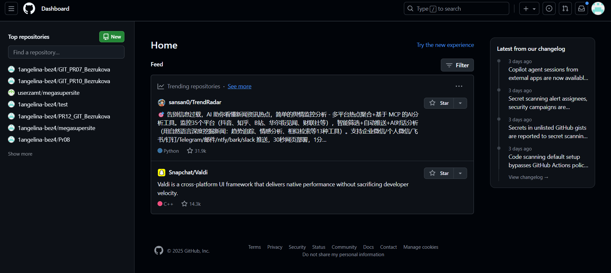

# Создание репозитория на GitHub

Для того что  создать репозиторий на GitHub потребуется выполнить следующие *шаги*:

__Шаг 1: Вход в аккаунт__

 1. Перейти на сайт [GitHub] (https://github.com/).
 2. Войти в свой аккаунт или зарегистрироваться.

 ()

__Шаг 2: Создание нового репозитория__

 На главной странице GitHub нажать на кнопку "+" в правом верхнем углу и выбрать "New repository".~~Для импорта существующего репозитория выберите "Import repository"~~

## Самое важное в создании репозитория

__Шаг 3: Настройка репозитория__

 1. Repository name: Введите имя вашего репозитория. Оно должно быть уникальным в пределах вашего аккаунта.
 2. Description (optional): Добавьте описание репозитория (необязательно).
 3. Public/Private: Выберите, будет ли ваш репозиторий общедоступным (public) или частным (private).
 4. Initialize this repository with:
   – Если хотите, можете выбрать опцию "Add a README file", чтобы создать файл README.md.
   – Также можно добавить .gitignore и выбрать лицензию, если это необходимо.

### Дополнительные сведенья о настройке репозитория 

| Категория | Настройка | Описание | Как настроить |
| --- | --- | --- | --- |
| **Основные параметры** | Название репозитория | Уникальное имя проекта | Settings > Repository name → Rename |
| | Описание репозитория | Аннотация проекта | Поле «Description» на главной странице |
| | Видимость | Определяет видимость репозитория | Settings > «Change repository visibility» |
| **Ветви (Branches)** | Основная ветвь | Имя главной ветки | Settings> Branches > Default branch |
| | Правила для ветвей | Защита ветвей | Settings > Branches > Protection rules |
| **Доступ и права** | Соавторы | Добавление пользователей | Settings > Manage access > Invite |
| | Команды | Назначение групп с доступом | Settings > Collaborators and teams |

__Шаг 4: Завершение создания__

 Нажмать на кнопку "Create repository".

__Шаг 5: Работа с репозиторием__

• Клонировать репозиторий на свой локальный компьютер.
• Загружать файлы через веб-интерфейс.
• Использовать команды Git для работы с репозиторием на вашем компьютере.

*Примеры команд Git*

### Проверить статус (какие файлы изменены/новые):
    
``git status``
    
### Добавить файлы в индекс (подготовить к коммиту):

``git add файл1.txt файл2.py``

### Или все изменённые файлы:

``git add .``

### Создать коммит (зафиксировать изменения):

``git commit -m "Описание изменений"``

### Пример:

``git commit -m "Добавлены функции авторизации"``

### Отправить изменения на GitHub:

``git push origin main``

>Примечания :book:
>
>Если вы выбрали опцию добавления README, то ваш репозиторий будет содержать этот файл сразу после создания.
>Вы также можете управлять настройками репозитория, добавлять коллабораторов и настраивать вебхуки в разделе "Settings".

## Полезные ссылки :star:
 - Официальная документация: https://docs.github.com/ru/repositories/creating-and-managing-repositories/creating-a-new-repository
